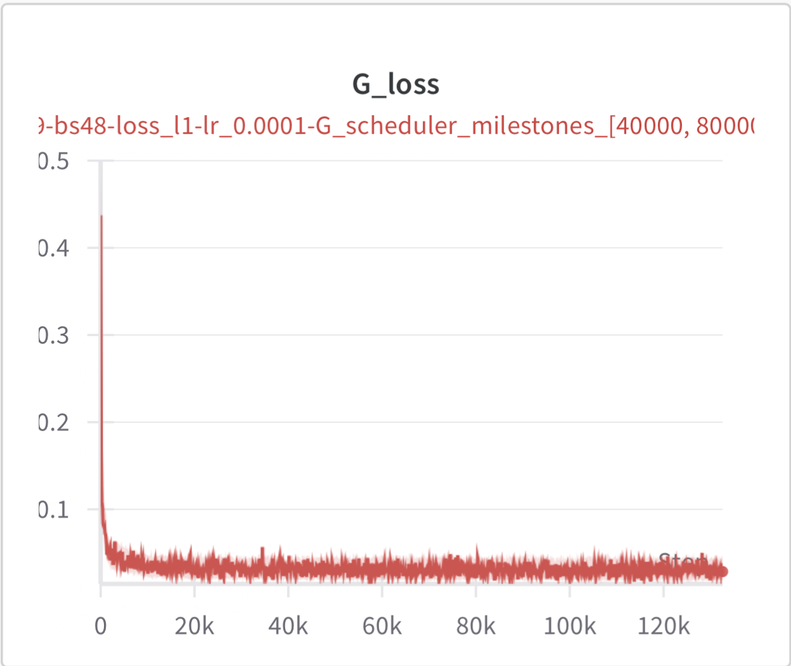
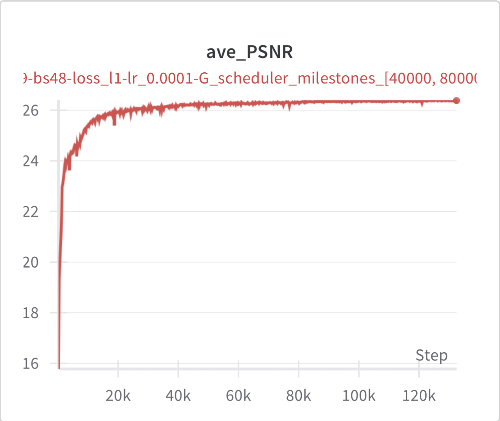

# Implement-USRNet

This repository is an unofficial implementation of the paper [Deep Unfolding Network for Image Super-Resolution](https://openaccess.thecvf.com/content_CVPR_2020/papers/Zhang_Deep_Unfolding_Network_for_Image_Super-Resolution_CVPR_2020_paper.pdf)

## File Structure

| File/Folder | Description |
| --- | --- |
| `img/` | img for readme |
| `options/` | configuration files |
| `kernels/` | pre-trained kernels |
| `model_zoo/` | pre-trained models |
| `models/` | model files |
| `testsets/` | test images |
| `utils/` | utility functions |
| `main_test_bicubic.py` `main_test_realapplication.py` `main_test_table1.py` | test code for images and tables in the paper |
| `USRNet.yaml` | conda environment file |
| `train.py` | **training code** |
| `test.py` | **test code** |

## [paper translation](USRNet.pdf)

## Instructions

1. Clone the repository
2. Create a conda environment using the provided `USRNet.yaml` file
3. Prepare the training and testing data:
    - For training, use DIV2K+Flickr2K datasets
    - For testing, use 100 images from ImageNet (you can download from [here](https://drive.google.com/drive/folders/1J4r24ZWWJ6uNqPoIUeowp2Y5zanEnB1M?usp=share_link))
4. Prepare the pre-trained models:
    - you can download pretrained models from [official pretrained models](https://drive.google.com/file/d/1qz8aaYOAMhoKn07VppFjRsDflYpxeVmz/view?usp=sharing) or [my pretrained models](https://drive.google.com/drive/folders/12m_6_KL4p-nGXjPzKMS7V0wxTOUm01jr?usp=share_link)
    - put the pretrained models in `model_zoo/` folder
4. Change the paths in `options/train_usrnet.json`:
    - "datasets"/"train"/"dataroot_H": your train data folder
    - "datasets"/"test"/"dataroot_H":  your test data folder
    - "path"/"root"/"pretrained_netG": your pre-trained model path（'xxx/Implement-USRNet/model_zoo/xxx.pth'）

## Reminder

I use `wandb` to log the training process. You can change `wandbconfig` to `True` in `test.py` and `train.py` if you want to use it.

When run `main_test_bicubic.py` `main_test_realapplication.py` `main_test_table1.py`, you need to change the `model_name` variable in the code to the name of the pre-trained model in the `model_zoo` folder.

## Visualize training Loss/PSNR

|  |  |
|-----------------------|-----------------------|

## Citation

```BibTex
@inproceedings{zhang2020deep, % USRNet
  title={Deep unfolding network for image super-resolution},
  author={Zhang, Kai and Van Gool, Luc and Timofte, Radu},
  booktitle={IEEE Conference on Computer Vision and Pattern Recognition},
  pages={3217--3226},
  year={2020}
}
```
